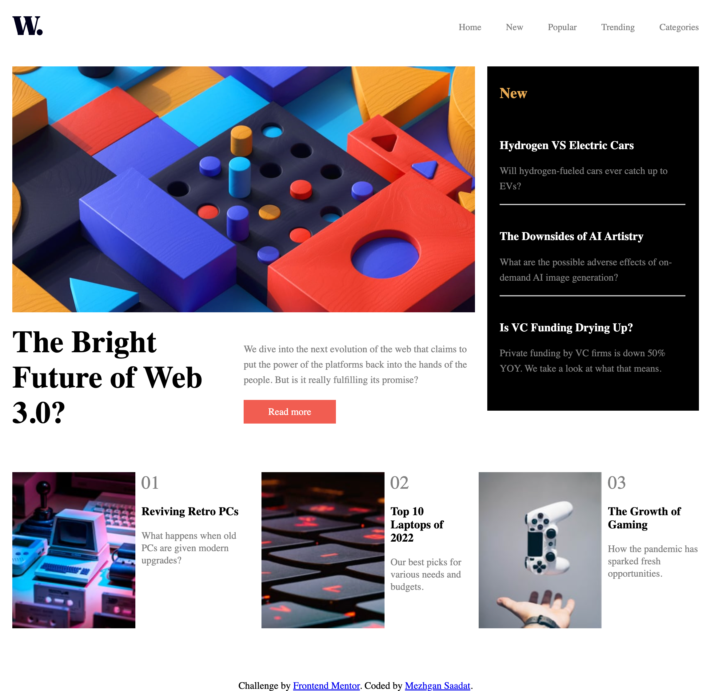
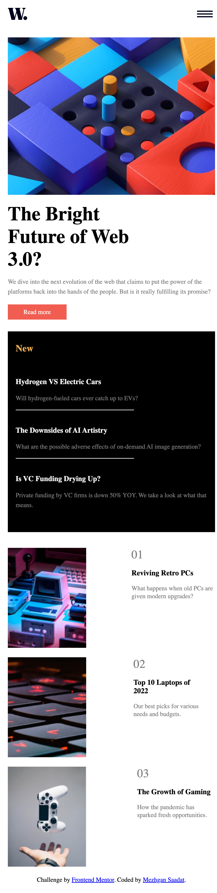

## Table of Contents: 
- [overview]
  - [link](#links)
- [My-process]
  - [Built with](#built-with)
  - [What I have learned](#what-i-learned)
  - [continue developing](#continue-developing)
  - [useful resources](#useful-resource)
- [Author](#author)

### Screenshot

### links

- Live Site URL (#link)

## My Progress

### Built with
- HTML5
- CSS
- Javascript

### what I have Learned
How to use javascript for opening and closing side bar for smaller screen

### Continue DEveloping
Keep learning how to use Javascript to add functionality to my side 

### Useful Resource
- [MDN](#https://developer.mozilla.org/en-US/)

### Author
- Website - [Mezhgan Saadat](#https://dev-portfoliodollar.pantheonsite.io/)
- frontend mentor - [Mezhgan Saadat](#https://www.frontendmentor.io/profile/MSaadat1)

